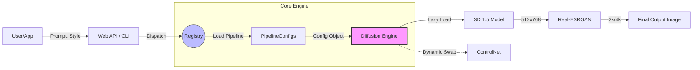

<div align="center">

# 🎨 Image Gen Lite Framework

### An Educational & Production-Inspired Stable Diffusion Engine

[](https://python.org)
[](https://pytorch.org)
[](https://huggingface.co/docs/diffusers)
[](LICENSE)

*A modular, plugin-based Stable Diffusion inference framework **designed for learning and real-world deployment**. Built with aggressive layer offloading to run production workloads locally on a GTX 1650 (4 GB VRAM).*

## ⚡ What is this?

- Run Stable Diffusion on 4GB GPUs (GTX 1650) without OOM crashes
- Plugin-based pipeline system (no messy if/else routing blocks)
- Fully supports community LoRAs, ControlNets, and Upscalers
- Built headless: wrap it instantly in Web, Desktop, or Mobile UIs

<div align="center">
  
  
  
  <br>
  
</div>

---

[**Quick Start**](#-quick-start) · [**How & Why it Works**](#️-how--why-this-architecture-is-built-for-the-long-run) · [**Benchmarks**](#-performance-benchmarks) · [**Managing Pipelines**](#-managing-multiple-pipelines) · [**Building UIs**](#-connecting-to-user-interfaces)

</div>

---

## 🎯 Project Goal

> [!NOTE]
> **TL;DR:** This is a minimalist, plugin-based Stable Diffusion 1.5 framework specifically optimized for 4GB GPUs (like the GTX 1650). It teaches you how to cleanly manage 10+ different AI art styles using a **Registry Pattern**, how to aggressively optimize VRAM using **layer offloading and subprocess isolation**, and how to attach web, desktop, or mobile UIs to a headless Python backend.

If you've ever wondered how to transition from messy Jupyter notebooks with hardcoded Stable Diffusion scripts into a **production-grade architecture** that can handle dozens of different art styles, models, and upscalers cleanly—this repository is your blueprint.

### 💡 Real-World Use Cases
- **Midjourney-Style Apps**: Wrap the engine in FastAPI to power your own Discord bots or web dashboards.
- **SaaS AI Tools**: Use the headless engine as a scalable backend generation API.
- **Low-Cost Local Hosting**: Run full inference pipelines on cheap, low-end hardware without OOM crashing.
- **Rapid Prototyping**: Experiment with LoRAs, ControlNets, and Schedulers via the decoupled Registry Pattern.

It demonstrates:
1. **The Registry Pattern**: How to manage multiple pipelines without massive `if/else` blocks.
2. **VRAM Mastery**: How to squeeze 2GB+ models, LoRAs, and ControlNets into a 4GB GPU without crashing.
3. **Engine Separation**: How to decouple the "What to generate" from the "How to execute it", making it trivial to attach a Web, Desktop, or Mobile UI.

---

## 🏗️ How & Why This Architecture is Built for the Long Run

Most open-source Stable Diffusion scripts start simple but quickly evolve into fragile monolithic scripts packed with `if/else` statements for every new model, autoencoder, or upscaler. 

**This framework takes a different approach.** It applies enterprise software engineering principles to AI inference, ensuring the codebase remains clean no matter how many pipelines, LoRAs, or SDKs you add.

### 📊 System Architecture



### Strategic Advantages

1. **The Registry Pattern (Zero-Friction Scaling):** Adding a new style to the engine requires zero modifications to the core inference logic. You simply drop a new file into `image_gen/pipeline/`, decorate it with `@register_pipeline`, and the engine handles the rest. This completely decouples "What to generate" from "How to execute it."
2. **Lazy-Loading & Dynamic Imports:** Loading 6 different schedulers, 4 upscalers, and 3 ControlNets at Python startup consumes over 1GB of system RAM before you even generate an image. This engine uses `importlib` to dynamically load modules *only at the moment they are requested by the generation config*, keeping the baseline footprint near zero.
3. **Subprocess Isolation Guarantee:** PyTorch's CUDA memory allocator is notorious for holding onto VRAM even after `torch.cuda.empty_cache()` is called. This framework guarantees **100% VRAM release** by architecting the engine to be run inside isolated requests where context cleanup forces absolute memory deallocation back to the OS.
4. **Headless by Design (Bring Your Own UI):** Whether you are building a React Web Dashboard, a PyQt local tool, or a Flutter mobile client, the backend architecture never changes. The engine expects a typed `PipelineConfigs` dataclass and returns a file path—making it trivial to wrap in FastAPI, Flask, or gRPC.

---

## 🛠️ Managing Multiple Pipelines

The core innovation of this framework is the **Pipeline Registry**.

Instead of writing a massive main file that tries to load every model, this framework uses an event-driven decorator pattern.

### How to Add Your Own Pipeline

Adding a new style pipeline takes **one file** and **zero engine modifications**.

1. Create a file in `image_gen/pipeline/my_style.py`
2. Use the `@register_pipeline` decorator:

```python
from configs.paths import DIFFUSION_MODELS, IMAGE_GEN_OUTPUT_DIR
from image_gen.pipeline.pipeline_types import PipelineConfigs
from image_gen.pipeline.registry import register_pipeline

@register_pipeline(
    name="my_custom_style",
    keywords=["mystyle", "custom art"],
    description="Minimal example pipeline"
)
def get_config(prompt: str, **kwargs) -> PipelineConfigs:
    return PipelineConfigs(
        base_model=DIFFUSION_MODELS["dreamshaper"],
        output_dir=IMAGE_GEN_OUTPUT_DIR / "custom",
        prompt=f"masterpiece, best quality, {prompt}",
        neg_prompt="worst quality, blurry",
        vae="realistic",
        style_type="realistic",
        scheduler_name="dpm++_2m_karras",
        width=512, height=768, steps=25, cfg=7.0
    )
```

3. Import it in `image_gen/pipeline/registry.py`:
```python
def discover_pipelines():
    from . import my_style
```

That's it. The CLI, API, and engine automatically know how to use it. The engine will lazily load the necessary components only when requested.

> 📖 See [docs/CUSTOM_PIPELINES.md](docs/CUSTOM_PIPELINES.md) for advanced tutorials on adding LoRAs and ControlNets to your pipelines.

---

## 🖥️ Connecting to User Interfaces

Because this framework strictly separates configuration (`PipelineConfigs`) from execution (`DiffusionEngine`), attaching a frontend UI is incredibly straightforward.

Whether you're building a web app, a desktop tool, or a mobile client, the backend interaction is always the same three steps:

### 1. Web UI (FastAPI / React / Vue)
Create a `server.py` using FastAPI:

```python
from fastapi import FastAPI, BackgroundTasks
from image_gen.engine import DiffusionEngine
from image_gen.pipeline.registry import discover_pipelines, get_pipeline

app = FastAPI()
discover_pipelines() # Load registry on startup

@app.post("/generate")
async def generate_image(prompt: str, style: str):
    # 1. Get the pipeline configuration
    config_fn = get_pipeline(style)["get_config"]
    config = config_fn(prompt=prompt)
    
    # 2. Execute
    engine = DiffusionEngine()
    saved_path = engine.generate(config)
    engine.unload() # Crucial for freeing VRAM for the next request
    
    return {"url": f"/static/{saved_path.name}"}
```

### 2. Desktop UI (PyQt6 / PySide6)
For a local desktop app, run the engine in a `QThread` to keep the UI responsive:

```python
from PyQt6.QtCore import QThread, pyqtSignal
from image_gen.engine import DiffusionEngine

class GeneratorThread(QThread):
    finished = pyqtSignal(str) # Emits the final image path

    def __init__(self, config):
        super().__init__()
        self.config = config

    def run(self):
        engine = DiffusionEngine()
        saved_path = engine.generate(self.config)
        engine.unload()
        self.finished.emit(str(saved_path))
```

### 3. Mobile UI (Flutter via REST API)
If you're building a Flutter app, host the FastAPI server above, then call it using Dart's `http` package:

```dart
import 'package:http/http.dart' as http;
import 'dart:convert';

Future<String> generateArt(String prompt, String style) async {
  final response = await http.post(
    Uri.parse('http://your-server.local:8000/generate'),
    body: jsonEncode({'prompt': prompt, 'style': style}),
    headers: {'Content-Type': 'application/json'},
  );
  
  if (response.statusCode == 200) {
    return jsonDecode(response.body)['url'];
  } else {
    throw Exception('Failed to generate image');
  }
}
```

---

## 🚀 Quick Start

### Prerequisites

- **Python** 3.10+
- **NVIDIA GPU** with CUDA support (minimum: GTX 1650, 4 GB VRAM)
- **PyTorch** with CUDA (see [pytorch.org](https://pytorch.org/get-started/locally/))

### 1. Clone and Install

```bash
git clone https://github.com/RajTewari01/image-gen.git
cd image-gen

# Install PyTorch with CUDA first (example for CUDA 12.1)
pip install torch torchvision --index-url https://download.pytorch.org/whl/cu121

# Install as an editable package with AI and Vision dependencies
pip install -e .[ai,vision]
```

### 2. Setup Models and Paths

1. Download models according to the [Model Downloads Guide](docs/MODELS.md).
2. Edit `configs/paths.py` to point to your `.safetensors` and `.pth` files.

### 3. Generate

Because this framework is installed as a pure Python package, you can run inference globally using the built-in CLI:

```bash
# List all registered styles
image-gen --list

# Anime style (automatically injects enhancers and negative prompts)
image-gen "beautiful anime girl with sword" --style anime

# Automotive engineering with sub-type specific LoRA injection
image-gen "midnight blue RX7 on mountain road" --style car --type rx7
```

---

## ⚡ Performance Benchmarks 

Optimized explicitly for low-end hardware, specifically the ubiquitous **Nvidia GTX 1650 (4GB VRAM)** laptop GPU.

### Hardware Testbed
* **GPU**: Nvidia GTX 1650 Ti (4GB GDDR6)
* **RAM**: 16GB DDR4
* **Backend**: CUDA 11.8 / PyTorch 2.1 / Diffusers 0.25+
* **Precision**: Forced `float32` (Required to prevent critical NaN/black images native to the 1650 architecture).

### Inference VRAM Footprints (Peak Usage)

This framework demonstrates exactly how to survive on a 4 GB GPU through aggressive layer management:

| Operation | Standard Diffusers | **Image Gen Framework** | Optimization Used |
|-----------|--------------------|-------------------------|-------------------|
| Load Base Model (SD 1.5) | 3.8 GB | **1.9 GB** | `enable_sequential_cpu_offload()` |
| VAE Decoding (512x768) | OOM Crash | **2.6 GB** | `enable_vae_slicing()` & `tiling()` |
| Attention Layers | +1.2 GB | **+0.4 GB** | `enable_attention_slicing("max")` |
| ControlNet (OpenPose) | OOM Crash | **3.8 GB** | Dynamic swap + Layer offload |
| Real-ESRGAN Upscale | +2.1 GB | **+0.6 GB** | Tile size 256 + Half-precision prep |

### Latency Profiles (GTX 1650)

| Pipeline | Resolution | Steps | Time to Generation |
|----------|------------|-------|--------------------|
| Anime (Meinamix) | 512x768 | 20 (Euler A) | ~14 - 18 seconds |
| Realistic Portrait | 512x768 | 25 (DPM++ 2M Karras) | ~22 - 25 seconds |
| Watercolor Sketch | 768x512 | 26 (Euler A) | ~18 - 20 seconds |
| Upscale (Real-ESRGAN) | 2048x3072 | Post-process | ~4 - 6 seconds |
| Img2Img Hallucination | 768x1152 | 15 (DPM++ SDE) | ~28 - 32 seconds |

---

## 🖼️ Render Gallery (Local 4GB VRAM)

These images were generated entirely locally on the 4GB GTX 1650 using the exact pipelines and upscaling stack defined in this repository:

<details>
<summary><b>Click to Expand Full Render Gallery (34 Proofs)</b></summary>

<table align="center" width="100%">
  <tr>
    <td width="33%"></td>
    <td width="33%"></td>
    <td width="33%"></td>
  </tr>
  <tr>
    <td></td>
    <td></td>
    <td></td>
  </tr>
  <tr>
    <td></td>
    <td></td>
    <td></td>
  </tr>
  <tr>
    <td></td>
    <td></td>
    <td></td>
  </tr>
  <tr>
    <td></td>
    <td></td>
    <td></td>
  </tr>
  <tr>
    <td></td>
    <td></td>
    <td></td>
  </tr>
  <tr>
    <td></td>
    <td></td>
    <td></td>
  </tr>
  <tr>
    <td></td>
    <td></td>
    <td></td>
  </tr>
  <tr>
    <td></td>
    <td></td>
    <td></td>
  </tr>
  <tr>
    <td></td>
    <td></td>
    <td></td>
  </tr>
  <tr>
    <td></td>
    <td></td>
    <td></td>
  </tr>
  <tr>
    <td></td>
    <td></td>
    <td></td>
  </tr>
</table>

</details>

---

## 🔬 Multi-Stage Upscaling Pipeline

The framework demonstrates how to string together multiple AI tools into a single pipeline.

1. **Diffusion Upscale** *(optional)*: Re-runs SD in img2img to hallucinate details.
2. **Real-ESRGAN** *(automatic)*: Selects between the standard 23-block model (`style_type="realistic"`) or the lightweight 6-block model (`style_type="anime"`).
3. **Lanczos** *(always)*: CPU-based sharpening and unsharp masking.

> 📖 See [docs/UPSCALERS.md](docs/UPSCALERS.md) for the architecture diagram and download links.

---

## 🧩 Workflow: From CivitAI to Custom Pipeline

This framework provides an end-to-end workflow for discovering a new model on CivitAI, learning how the community uses it, and deploying it as a permanent style pipeline.

### Step 1: Add Your Model
1. Download any Stable Diffusion v1.5 model `.safetensors` file from CivitAI.
2. Place it in your model directory (e.g., `models/stable-diffusion/my_model.safetensors`).
3. Add its path to your configuration file in `configs/paths.py`:
```python
DIFFUSION_MODELS = {
    "my_model": STABLE_DIFFUSION_DIR / "my_model.safetensors"
}
```

### Step 2: Scrape Community Prompts
Instead of guessing which trigger words or "quality boosters" work best for your new model, scrape the top community generations using the **API Scraper**.

```bash
cp .env.example .env  # Add your CIVITAI_API_KEY
python scripts/api_scraper.py https://civitai.com/models/46294
```
This script downloads metadata from the highest-rated images for that model and saves a structured dataset to `assets/prompts/model_46294_prompts.json`. This JSON contains raw prompts, negative prompts, steps, CFG scales, and samplers.

### Step 3: Enhance and Register
Now, create your pipeline file. Under the hood, the **Smart Prompt Enhancer** reads the JSON dataset, counts the most frequent trigger keywords, LoRAs, and optimal settings (steps/CFG), and dynamically injects them into the user's prompt.

Create `image_gen/pipeline/my_pipeline.py`:

```python
from configs.paths import DIFFUSION_MODELS, IMAGE_GEN_OUTPUT_DIR
from image_gen.pipeline.pipeline_types import PipelineConfigs
from image_gen.pipeline.registry import register_pipeline

# Import the enhancer we generated data for
from scripts.prompt_enhancer import ModelPromptEnhancer

@register_pipeline(
    name="my_new_style",
    keywords=["new style", "custom art"],
    description="Pipeline powered by scraped community data."
)
def get_config(prompt: str, **kwargs) -> PipelineConfigs:
    
    # 1. Let the enhancer read the JSON and determine the optimal settings
    enhancer = ModelPromptEnhancer(model_id=46294)
    learned_data = enhancer.enhance(prompt)
    
    # 2. Return the config object injected with community-learned parameters
    return PipelineConfigs(
        base_model=DIFFUSION_MODELS["my_model"],
        output_dir=IMAGE_GEN_OUTPUT_DIR / "custom_style",
        
        # Injected from the JSON analysis:
        prompt=learned_data.prompt,
        neg_prompt=learned_data.negative_prompt,
        steps=learned_data.steps,
        cfg=learned_data.cfg_scale,
        scheduler_name=learned_data.sampler,
        
        width=512, height=768,
        style_type="realistic"
    )
```

Finally, simply import this file in `image_gen/pipeline/registry.py`. You have just built a completely automated, data-driven AI inference pipeline!

---

## 📖 Deep Dives

Want to understand how it all works under the hood?

| Document | Description |
|----------|-------------|
| [Architecture Guide](docs/ARCHITECTURE.md) | How the engine lifecycle and VRAM management works |
| [Custom Pipelines](docs/CUSTOM_PIPELINES.md) | Full tutorial for creating your own pipelines |
| [Upscalers Guide](docs/UPSCALERS.md) | Upscaler mechanics, downloads, and troubleshooting |
| [Model Downloads](docs/MODELS.md) | Where to download all the weights used in this project |

---

## 📄 License

This project is licensed under the [MIT License](LICENSE).
