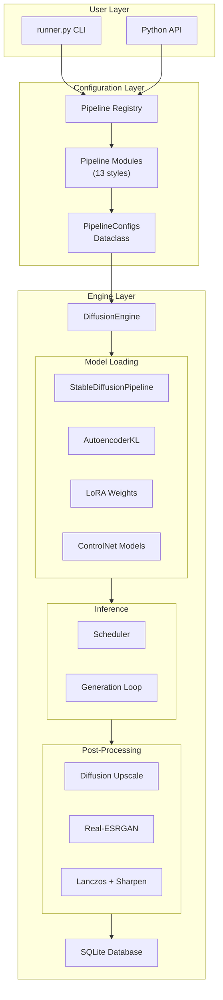

# Architecture

## Table of Contents

- [System Overview](#system-overview)
- [Engine Lifecycle](#engine-lifecycle)
- [Pipeline Registry Pattern](#pipeline-registry-pattern)
- [Dynamic Import Strategy](#dynamic-import-strategy)
- [VRAM Management](#vram-management)
- [Database Tracking](#database-tracking)
- [Upscaling Pipeline](#upscaling-pipeline)

---

## System Overview

Image Gen is a modular Stable Diffusion 1.5 inference engine. The design separates **what to generate** (pipelines) from **how to generate** (engine), connected by a typed configuration dataclass (`PipelineConfigs`).



---

## Engine Lifecycle

The `DiffusionEngine` class manages the complete lifecycle of a generation:

### 1. Model Loading (`load_model`)

```
load_model(config) →
    1. Check if model/VAE changed (skip reload if same)
    2. Load VAE (from preset name or custom path)
    3. Load SD pipeline (from_single_file)
    4. Load textual inversions (embeddings)
    5. Apply VRAM optimizations:
       - enable_sequential_cpu_offload()
       - enable_vae_slicing()
       - enable_vae_tiling()
       - enable_attention_slicing(slice_size="max")
    6. Load scheduler (dynamic import)
    7. Cache current model/VAE state
```

### 2. Generation (`generate`)

```
generate(config) →
    1. load_model(config)
    2. Handle LoRAs (unfuse old → load new → fuse → inject trigger words)
    3. Prepare generation kwargs (prompt, neg, size, steps, cfg, seed)
    4. If ControlNet: preprocess images → add to kwargs
    5. Run pipeline inference
    6. 3-stage upscaling:
       a. Diffusion img2img (optional, --add_details)
       b. Real-ESRGAN (auto-selected by style_type)
       c. Lanczos + sharpen + contrast
    7. Save image to disk
    8. Record to SQLite database
    9. Return save path
```

### 3. Cleanup (`unload`)

```
unload() →
    1. Delete pipeline object
    2. Clear model/VAE cache references
    3. gc.collect() + torch.cuda.empty_cache()
```

---

## Pipeline Registry Pattern

The registry uses a **decorator-based self-registration** pattern. This eliminates hardcoded pipeline lists and allows plug-and-play pipeline creation.

### How It Works

```python
# 1. DECORATOR — Each pipeline file decorates its config function
@register_pipeline(
    name="car",
    keywords=["car", "vehicle", "automobile"],
    description="Car generation with LoRA styles",
    types={"rx7": "Mazda RX7 JDM", "sedan": "Generic sedan"}
)
def get_car_config(prompt: str, style: str = None, **kwargs) -> PipelineConfigs:
    # Returns fully configured PipelineConfigs
    ...

# 2. GLOBAL REGISTRY — The decorator stores the function in a dict
PIPELINE_REGISTRY = {
    "car": {
        "get_config": get_car_config,
        "keywords": ["car", "vehicle", "automobile"],
        "description": "Car generation with LoRA styles",
        "types": {"rx7": "Mazda RX7 JDM", ...}
    }
}

# 3. DISCOVERY — Importing the module triggers registration
def discover_pipelines():
    from . import anime, cars, zombie, ...  # Decorators fire on import
```

### Adding a Pipeline

1. Create `image_gen/pipeline/my_style.py` with `@register_pipeline`
2. Add `my_style` to the import list in `discover_pipelines()`
3. The CLI automatically picks up `--style my_style` and `--type` options

---

## Dynamic Import Strategy

The engine uses `importlib.import_module()` to lazily load heavy modules:

```python
# Schedulers — loaded only when requested
module = importlib.import_module(f".schedulars.{module_name}", package="image_gen")

# Upscalers — loaded only when needed
module = importlib.import_module(f".upscalers.{module_name}", package="image_gen")

# ControlNet — loaded only when config has c_net entries
cn_module = importlib.import_module(f".controlnet.{cn_module_name}", package="image_gen")
```

### Why Dynamic Imports?

| Approach | RAM at Startup | RAM When Using 1 Scheduler |
|----------|----------------|---------------------------|
| Static `from ... import *` | All 6 schedulers loaded | All 6 schedulers loaded |
| Dynamic `importlib` | 0 schedulers loaded | 1 scheduler loaded |

On a 4 GB VRAM / 16 GB RAM system, this prevents hundreds of MB of unnecessary library loading.

---

## VRAM Management

### The GTX 1650 Problem

The GTX 1650 has **4 GB VRAM** and a critical quirk: **float16 precision produces NaN values** (black images) on many operations. This forces float32, which **doubles** VRAM usage.

### Solution Stack

```
┌─────────────────────────────────────────┐
│ Float32 Precision (stability)           │  ← Can't avoid on GTX 1650
├─────────────────────────────────────────┤
│ Sequential CPU Offload                  │  ← Massive VRAM reduction
│ Layers swap GPU ↔ RAM mid-inference     │
├─────────────────────────────────────────┤
│ VAE Slicing + Tiling                    │  ← ~40% reduction during decode
│ Process VAE in chunks                   │
├─────────────────────────────────────────┤
│ Attention Slicing (max)                 │  ← Reduces attention peak
│ Sequential attention computation        │
├─────────────────────────────────────────┤
│ Subprocess Isolation                    │  ← 100% VRAM cleanup guarantee
│ Process dies → VRAM fully released      │
└─────────────────────────────────────────┘
```

### Critical Code Path

```python
# engine.py — The "GTX 1650 Survival Kit"
self.pipe.enable_sequential_cpu_offload()     # Layers on CPU, only active layer on GPU
self.pipe.enable_vae_slicing()                 # Decode in chunks
self.pipe.enable_vae_tiling()                  # Tile large images
self.pipe.enable_attention_slicing(slice_size="max")  # Smallest possible attention chunks
```

---

## Database Tracking

Every generated image is recorded in a SQLite database (`image_gen/database/images.db`) with full provenance:

### Schema

| Column | Type | Description |
|--------|------|-------------|
| `image_path` | TEXT | Path to generated image |
| `canny_image_path` | TEXT | Path to ControlNet edge map (if used) |
| `base_model` | TEXT | Checkpoint file path |
| `prompt` | TEXT | Full generation prompt |
| `neg_prompt` | TEXT | Negative prompt |
| `width` / `height` | INT | Image dimensions |
| `steps` | INT | Inference steps |
| `cfg` | REAL | Classifier-free guidance scale |
| `seed` | INT | Random seed (for reproducibility) |
| `vae` | TEXT | VAE variant used |
| `scheduler_name` | TEXT | Scheduler used |
| `upscale_method` | TEXT | Upscaler chain used |
| `loras` | TEXT (JSON) | LoRA paths, scales, triggers |
| `controlnets` | TEXT (JSON) | ControlNet types, images, scales |
| `created_at` | TIMESTAMP | Generation timestamp |

### Query API

```python
from image_gen.database import (
    get_recent_images,
    search_images_by_prompt,
    get_images_by_model,
)

# Last 20 generations
recent = get_recent_images(limit=20)

# Search by prompt keyword
results = search_images_by_prompt("zombie")

# Filter by model
model_results = get_images_by_model("meinamix")
```

---

## Upscaling Pipeline

The 3-stage upscaling pipeline is described in detail in [UPSCALERS.md](UPSCALERS.md).

The key architectural decision is **auto-selection**: the engine reads `config.style_type` and automatically picks the correct ESRGAN model:

```python
# engine.py line 407
esrgan_name = "R-ESRGAN 4x+ Anime6B" if config.style_type == "anime" else "R-ESRGAN 4x+"
```

This means pipeline authors just set `style_type="anime"` or `style_type="realistic"` in their `PipelineConfigs` and the upscaler is handled automatically.
